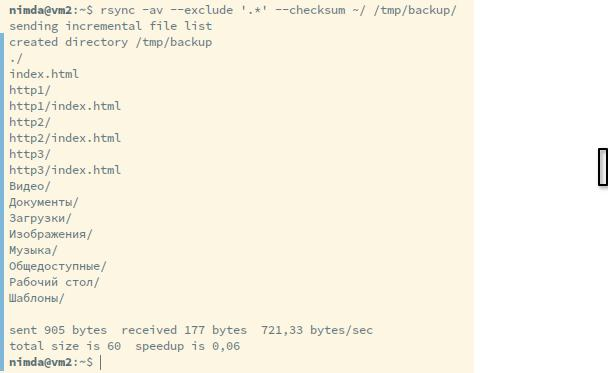
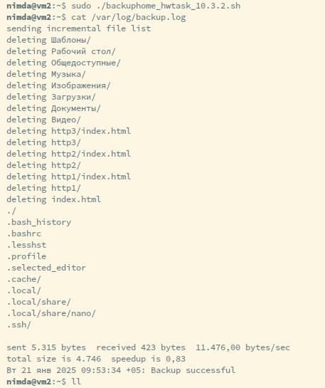
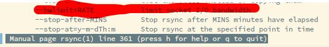
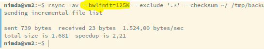

# Домашнее задание к занятию "`Резервное копирование`" - `Горелов Николай`

### Задание 1
- Составьте команду rsync, которая позволяет создавать зеркальную копию домашней директории пользователя в директорию `/tmp/backup`
- Необходимо исключить из синхронизации все директории, начинающиеся с точки (скрытые)
- Необходимо сделать так, чтобы rsync подсчитывал хэш-суммы для всех файлов, даже если их время модификации и размер идентичны в источнике и приемнике.
- На проверку направить скриншот с командой и результатом ее выполнения

---

### Решение 1

- nimda@vm2:~$ rsync -av --exclude '.*' --checksum ~/ /tmp/backup/
  - -a – архивный режим (рекурсивное копирование и сохранение характеристик файлов).
  - -v – вывод информации о процессе копирования.
  - --exclude '.*' – исключает все директории и файлы, начинающиеся с точки (скрытые).
  - --checksum – заставляет rsync сравнивать файлы по хэш-сумме, а не по времени и размеру.

- 

---

### Задание 2
- Написать скрипт и настроить задачу на регулярное резервное копирование домашней директории пользователя с помощью rsync и cron.
- Резервная копия должна быть полностью зеркальной
- Резервная копия должна создаваться раз в день, в системном логе должна появляться запись об успешном или неуспешном выполнении операции
- Резервная копия размещается локально, в директории `/tmp/backup`
- На проверку направить файл crontab и скриншот с результатом работы утилиты.

---

### Решение 2

- [crontab](HW/10.3.2_crontab_nimda)

- 

---

## Задания со звёздочкой*
Эти задания дополнительные. Их можно не выполнять. На зачёт это не повлияет. Вы можете их выполнить, если хотите глубже разобраться в материале.

---

### Задание 3*
- Настройте ограничение на используемую пропускную способность rsync до 1 Мбит/c
- Проверьте настройку, синхронизируя большой файл между двумя серверами
- На проверку направьте команду и результат ее выполнения в виде скриншота

---

### Решение 3

- 
- 

---

### Задание 4*
- Напишите скрипт, который будет производить инкрементное резервное копирование домашней директории пользователя с помощью rsync на другой сервер
- Скрипт должен удалять старые резервные копии (сохранять только последние 5 штук)
- Напишите скрипт управления резервными копиями, в нем можно выбрать резервную копию и данные восстановятся к состоянию на момент создания данной резервной копии.
- На проверку направьте скрипт и скриншоты, демонстрирующие его работу в различных сценариях.

------